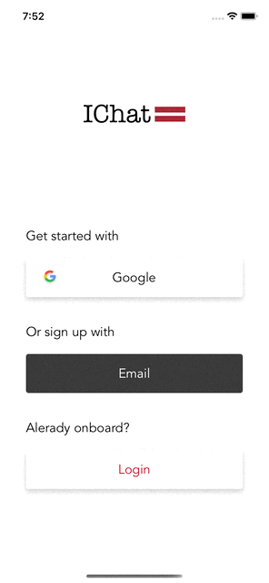
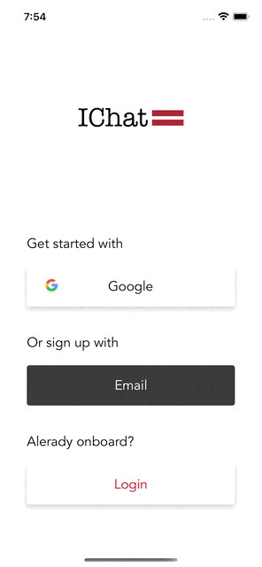

# ChatApp
## Simple Chat APP

An iChat App for iOS writing with Swift. Learning project. Some features: Email/Google Authentication, 
  Firebase Firestore and Storage, 
  Real-time chat with image/text messages, 
  Global users search,
  User profile setup,
  NSLayoutAnchor and StackViews,
  UICollectionView Compositional Layout,
  UICollectionView Diffable Datasource,
  MessageKit
  

